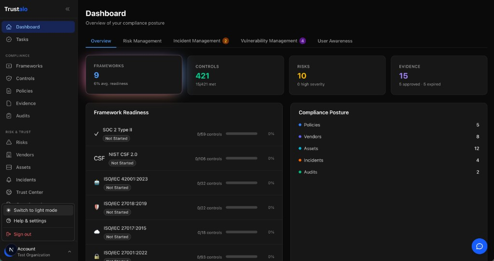

# Trustalo

> Source-available compliance management platform — free for startups, modern stack, batteries included.

<p align="center">
  
</p>

Trustalo is a multi-tenant GRC platform that helps teams adopt and maintain **ISO 27001**, **ISO 27017**, **ISO 27018**, **ISO 22301**, **ISO 42001**, and **SOC 2** without buying a six-figure enterprise tool. It is built as a Bun monorepo with TypeScript end-to-end, ships its own evidence collector, and runs unmodified on a developer laptop or in a Bedrock-only AWS account.

| Aspect | Value |
| --- | --- |
| Status | Pre-1.0. APIs and schemas may change between minor versions. |
| License | Dual-licensed. Core code under [Trustalo Source-Available Commercial License v1.0](LICENSE) — free for organizations under USD 1M revenue **and** USD 1M funding. Files matching `*.ee.*` or under `**/ee/**` are governed by the [Trustalo Enterprise License v1.0](LICENSE_EE) — paid Enterprise License required for production regardless of org size. Redistribution is reserved to Trustalo. See [`docs/enterprise.md`](docs/enterprise.md). Contributors must accept the [`CONTRIBUTOR_LICENSE_AGREEMENT.md`](CONTRIBUTOR_LICENSE_AGREEMENT.md). |
| Runtime | Bun 1.3+ · TypeScript 5.x (strict) · Next.js 16 · Express 5 · Prisma 7 + PostgreSQL 17 · MongoDB 8 |
| Get started | [`docs/installation.md`](docs/installation.md) — prerequisites + quick start. Daily loop: [`docs/development.md`](docs/development.md). |
| Architecture | [`docs/architecture.md`](docs/architecture.md) · [`docs/database-design.md`](docs/database-design.md) |

---

## Why Trustalo

- **Multi-framework by design.** A single piece of evidence satisfies multiple frameworks via cross-framework control mappings. Adding a new framework is a data change, not a code change.
- **AI accelerators that are advisory, audited, and operator-controlled.** Policy drafting, risk scoring, vendor tiering, NL check generation, questionnaire answering, Trust Center summaries, page-aware chat — every call goes through a single resolver, is rate-limited, audit-logged, and never auto-applies. See [`docs/ai-features.md`](docs/ai-features.md).
- **Pluggable everywhere it matters.** Authentication, storage, queue, and AI provider are all interfaces with multiple implementations. Bring your own with a small plugin instead of forking.
- **Source-available, free for the people who need it most.** Local dev, testing, evaluation, learning, and production use by qualified organizations are free. Larger orgs and SaaS resale require a commercial license. **Redistribution is reserved to Trustalo** — you can run, modify, and self-host, but you cannot fork, mirror, or repackage the project for others. The full plain-English summary is in the [License](#license) section below; the [`LICENSE`](LICENSE) file is authoritative.
- **Self-hostable end-to-end.** PostgreSQL + MongoDB + LocalStack via `docker compose up` — no managed-service lock-in.

---

## Architecture at a glance

```
trustalo/
├── apps/
│   ├── web/           Next.js 16 SSR frontend (port 3000)
│   ├── api/           Express 5 + Prisma + Mongoose (port 4000)
│   └── collector/     Express 5 + Prisma (port 4001)
└── packages/
    ├── shared/                       Types, Zod schemas, constants, utils
    ├── auth/                         JWT, RBAC, cookie + bearer middleware
    ├── auth-provider-{local,cognito,keycloak}/
    ├── storage/                      S3 storage provider (pluggable; _template scaffold for new backends)
    ├── queue/                        SQS queue provider (pluggable; _template scaffold for new backends)
    ├── ai/                           AI provider resolver, PII scrubber, prompt guard
    └── integration-manifests/        AWS, GitHub, GitLab, Google Workspace, Microsoft 365, Okta
```

The **API** owns the compliance domain (frameworks, controls, policies, risks, evidence, audits, vendors, assets, incidents, vulnerabilities, BCP, AI governance, privacy, training, trust center). The **Collector** owns the integration domain (the catalog, connections, credentials in a transactional secret vault, jobs, sync logs) and submits evidence to the API via HMAC-signed internal calls. Nine connectors ship today (`aws`, `gcp`, `azure`, `okta`, `auth0`, `github`, `bitbucket`, `google-workspace`, `office365`); a separate `@trustalo/integration-manifests` package ships declarative check manifests (including a `gitlab` manifest that does not yet have a runtime connector). The **Web** frontend talks to both services directly through the cookie-based session.

Deeper dive: [`docs/architecture.md`](docs/architecture.md) and [`docs/integrations.md`](docs/integrations.md).

---

## Quick start

```bash
git clone <your-fork-url> trustalo && cd trustalo
bun run setup:local                                  # envs + Postgres/Mongo/LocalStack + deps + Prisma + seeds
bun dev:all                                          # Web :3000, API :4000, Collector :4001
```

> `bun run setup:local` is idempotent — it copies env templates only when missing, starts Docker, generates Prisma clients, applies migrations, and seeds the API/Collector data. See [`docs/installation.md`](docs/installation.md) for the per-step manual path.
>
> `bun dev` starts only the API + Web. Use `bun dev:all` when you need background syncs to run, or `bun run dev:collector` to start the Collector on its own.

The full walkthrough — every prerequisite, every env var, troubleshooting, and the seeded demo org — lives in [`docs/installation.md`](docs/installation.md). For the day-to-day loop (scripts, project structure, conventions), see [`docs/development.md`](docs/development.md).

---

## Security posture

Trustalo was recently hardened end-to-end. The controls below are all in the codebase today and exercised by the runtime/DAST pass; the corresponding fix landed in the `Security audit fixes` commit and a follow-up runtime pass.

| Control | Where |
| --- | --- |
| AES-256-GCM envelope encryption at rest | `apps/api/src/lib/crypto-envelope.ts` (versioned `enc:v1:` prefix, lazy migration) |
| HMAC-SHA256 service-to-service request signing | `apps/api/src/lib/service-auth.ts`, `apps/collector/src/lib/service-auth.ts` |
| `HttpOnly` + `SameSite=Lax` session cookies | `packages/auth/src/middleware.ts`, `apps/api/src/modules/auth/router.ts` |
| Production-fail-fast secret + CORS validation | `apps/api/src/config/security.ts`, `apps/collector/src/config/security.ts` |
| Per-request CSP nonce + `strict-dynamic` | `apps/web/src/proxy.ts` (Next.js 16 proxy file) |
| Auth login rate limiting (`AUTH_MAX_ATTEMPTS=20`) | `apps/api/src/modules/auth/router.ts` |
| Trust-center token-in-URL route retired (410) | `apps/api/src/modules/trust-center/router.ts` |
| CodeQL `security-extended` SAST | `.github/workflows/codeql.yml` |
| License allowlist + gitleaks secret scan + `bun audit` | `.github/workflows/security-checks.yml`, `.github/workflows/license-check.yml` |
| Vendored-AGPL guard (fails on AGPL headers in committed source) | `.github/workflows/no-vendored-agpl.yml` |

Multi-tenant isolation: tenant context is derived from the JWT and is never trusted from a header. The DAST pass confirmed direct IDOR and forged `X-Organization-Id` attempts both fall back to "not found" semantics.

---

## AI provider (self-hosting)

Trustalo's AI features read their model from a three-layer precedence chain so the same codebase works for self-hosted, Bedrock-only AWS, and multi-tenant SaaS deployments without code changes:

1. **Operator default** — set at deploy time via env, applies to every tenant unless overridden.
2. **Per-organization override** — Settings → AI in the dashboard.
3. **Per-feature override** — finest grain (cheap Haiku for risk scoring, premium Sonnet for policy drafting).

The resolved provider/model/source for each feature is visible at `GET /api/v1/ai-config/health` and on the dashboard "AI Status" tile.

Provider keys configured via the dashboard are encrypted at rest with AES-256-GCM (see security posture above). Set `AI_PROVIDER=none` to disable AI entirely and rely on per-org config; AI features then fail closed with `AINotConfiguredError`.

The full operator env-var matrix and the per-feature audit contract live in [`docs/ai-features.md`](docs/ai-features.md).

---

## Authentication

Trustalo ships with a pluggable authentication system. Exactly one provider is active per deployment, selected at boot via `AUTH_PROVIDER`:

| `AUTH_PROVIDER`     | Use case                                                         |
| ------------------- | ---------------------------------------------------------------- |
| `local` _(default)_ | Email + password (bcrypt). Best for local dev.                   |
| `cognito`           | AWS Cognito Hosted UI — MFA, social, SAML.                       |
| `keycloak`          | Self-hosted Keycloak (OIDC discovery, PKCE, admin provisioning). |
| `external`          | Dynamic-import any third-party plugin (Okta, Auth0, custom).     |

Sessions are issued as `HttpOnly` cookies; a Bearer fallback is accepted during rollout. See [`docs/auth-providers.md`](docs/auth-providers.md) for the provider contract, the Cognito/Keycloak walkthroughs, and a worked example for writing your own plugin. A starter template lives at [`examples/auth-provider-template/`](examples/auth-provider-template/).

---

## Documentation

In-depth documentation lives in [`docs/`](docs/):

| Doc | What it covers |
| --- | --- |
| [`installation.md`](docs/installation.md) | Prerequisites, quick start, env vars, docker, troubleshooting. |
| [`development.md`](docs/development.md) | Daily loop, scripts, project structure, conventions, contributing. |
| [`architecture.md`](docs/architecture.md) | High-level system design, service boundaries, data flow. |
| [`api-reference.md`](docs/api-reference.md) | REST endpoints exposed by the API service. |
| [`database-design.md`](docs/database-design.md) | Prisma schemas (PostgreSQL) and Mongoose models (MongoDB). |
| [`auth-providers.md`](docs/auth-providers.md) | Pluggable auth contract, built-in providers, custom plugin walkthrough. |
| [`ai-features.md`](docs/ai-features.md) | AI provider resolution, audit, rate limiting, advisory contract. |
| [`compliance-frameworks.md`](docs/compliance-frameworks.md) | Supported frameworks, control mappings, maturity model. |
| [`integrations.md`](docs/integrations.md) | Collector integration framework and how to add a provider. |
| [`permissions-matrix.md`](docs/permissions-matrix.md) | RBAC roles and the permissions each one grants. |

---

## Contributing

Issues and pull requests are welcome. The short version:

1. Open an issue to discuss substantial changes before writing code.
2. Run `bun run test`, `bun run test:coverage`, `bun run typecheck`, `bun run lint`, and `bun run format` before pushing. PRs must pass the coverage gate (minimum package-level line coverage >= 75%).
3. Keep PRs focused — one logical change per PR.
4. Reference the relevant `docs/` page in your PR description so it stays in sync.
5. AI-touching PRs must satisfy every checkbox in [`.cursor/rules/ai-features.mdc`](.cursor/rules/ai-features.mdc) and include the originality attestation from [`.github/PULL_REQUEST_TEMPLATE.md`](.github/PULL_REQUEST_TEMPLATE.md).

By contributing, you accept the [Trustalo Contributor License Agreement](CONTRIBUTOR_LICENSE_AGREEMENT.md), which grants the Project a perpetual, sublicensable license to use your contributions under the [Core License](LICENSE), the [Enterprise License](LICENSE_EE), or any future license the Project chooses. PRs cannot be merged until every contributor on the PR has accepted the CLA.

---

## License

Trustalo is **source-available** under a **dual license**. Both license files at the repo root are authoritative.

| File | Covers | Audience |
| --- | --- | --- |
| [`LICENSE`](LICENSE) — Trustalo Source-Available Commercial License v1.0 | All source code, build artifacts, configuration, and documentation **except** EE Files | Free for Qualified Organizations (< USD 1 M revenue _and_ < USD 1 M funding); paid commercial license required above the threshold |
| [`LICENSE_EE`](LICENSE_EE) — Trustalo Enterprise License v1.0 | "EE Files" — any file with `.ee.` in its filename, or any file under a directory named `ee` or matching `**/ee/**` | Paid Trustalo Enterprise License required for any **production** use, **regardless of org size** |
| [`CONTRIBUTOR_LICENSE_AGREEMENT.md`](CONTRIBUTOR_LICENSE_AGREEMENT.md) — Contributor License Agreement v1.0 | Every contribution submitted to this repository | All contributors must accept it before their PR can be merged |

> This is _not_ an OSI-approved open source license. The tables on this page are a plain-English summary — [`LICENSE`](LICENSE) and [`LICENSE_EE`](LICENSE_EE) are binding.
>
> **Redistribution is reserved to Trustalo.** You can run and modify Trustalo on your own infrastructure, but you cannot fork, mirror, repackage, or otherwise distribute the code (in source or compiled form) to anyone else without prior written permission.
>
> **Enterprise features are paywalled.** SSO/SAML, multi-tenant trust center, premium AI features, and other capabilities marked as EE Files require a paid Enterprise License to run in production, even for small organizations that get the core for free. See [`docs/enterprise.md`](docs/enterprise.md) for the current EE feature list and the file-naming convention.

### Core (non-EE) — what you can do under [`LICENSE`](LICENSE)

| Use case | Allowed without a commercial license? |
| --- | --- |
| Local development, testing, evaluation, learning, contributing | Yes — for everyone. |
| **Production** use by an organization with **< USD 1 M annual revenue _and_ < USD 1 M total external funding** | Yes — free, no purchase required. |
| **Production** use by an organization at or above either threshold | Requires a commercial license. |
| Modify the code for your own internal use (modifications stay within your organization) | Yes. |
| Redistribute the code (forks, mirrors, public or private re-hosting, repackaging) | **No** — reserved to Trustalo. Requires prior written permission. |
| Push or mirror the code to any public or private code/container/package registry | **No** — reserved to Trustalo. Requires prior written permission. |
| Bundle the code into a product or service you offer to third parties | **No** — requires both a commercial license and written distribution permission. |
| Repackage as a hosted/SaaS offering you sell to third parties | **No** — requires both a commercial license and written distribution permission. |

### EE Files — what you can do under [`LICENSE_EE`](LICENSE_EE)

| Use case | Allowed without an Enterprise License? |
| --- | --- |
| View, read, audit, security-review the EE source code | Yes. |
| Develop, test, evaluate EE features in non-production environments | Yes. |
| Run any EE feature in **production**, regardless of org size or revenue | **No** — paid Trustalo Enterprise License required. |
| Bypass, remove, or tamper with any license-key check on EE features | **No** — material breach; rights terminate immediately. |
| Distribute, mirror, or repackage EE Files | **No** — reserved to Trustalo. |

If your organization needs a commercial license, an Enterprise License, or an exception to the redistribution rules (for example, an internal artifact registry in a regulated environment), please open an issue or reach out via the contact details on the project page.
